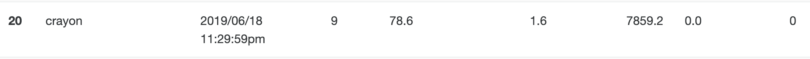

# genome-assembly

Assemble genomes with de Bruijn graph.

## Data

* 4 datasets are provided (`data4` are much larger), unzip them:

```
unzip data1.zip
unzip data2.zip
unzip data3.zip
unzip data4.zip
```

## Usage

* Set a much higher recursion limit as it reaches deep recursion depth running DFS(depth first search) in de Bruijn graph. Set a new recursion limit in python using:

```python
import sys
sys.setrecursionlimit(100000)
```

* As `data4` is much larger than the others, the normal stack size is not likely to be enough. Set a much higher stack size by the following command (only for Linux):

```
ulimit -s 8192000
```

* Build de Bruijn gragh and output assembled genomes by:

```
python main.py data1
python main.py data2
python main.py data3
python main.py data4
```

## Result





## Implementation

Check `report.pdf` for details.

## data1

1919, 1942，之前的

7284，只用short1
8751，short1和2

23:99.886	1.9802	9118.8	2.0	0
25:9118，(用了全部，输出前20条和前100条无区别)

## data2
25:9129
## data3
25:7859
## data4

Segmentation fault: 11?

980 short1
1339 short2
只用long没用

25:全用是55757


stack size:
ulimit -s 819200

recursion limit:
sys.setrecursionlimit(1000000)


data1
21:99.886	1.9924	8917.6	3.0	0
23:99.886	1.9802	9118.8	2.0	0
(25:99.884	1.93	8906.4	2.0	0)
25:99.886	1.982	9118.8	2.0	0
27:	99.886	1.982	9118.8	2.0	0
29:86.44	1.9582	8291.0	1.0	0

data2
21:	96.996	2.0174	7896.4	4.0	0
23:97.624	2.0018	9129.2	4.0	0
25:99.942	1.9982	9129.2	3.0	0
27:99.942	2.0112	9125.0	3.0	0
29:99.942	2.0112	9124.8	2.0	0

data3
21:76.022	1.6098	7028.0	0.0	0
23:	78.6	1.6	7859.2	0.0	0
25:78.6	1.6	7859.2	0.0	0
27:78.6	1.6	7859.2	0.0	0
29:78.6	1.6	7859.2	0.0	0

data4
21:71.1484	1.5456	34288.4	4.0	0
23:	76.5692	1.573	50574.2	8.0	0
25:78.2948	1.607	55757.8	11.0	0
27:76.3098	1.6056	49869.4	12.0	0
29:65.3972	1.5358	28856.0	12.0	0


```python
build_DBG(G(V, E), data):
    for each read in data:
        rc_read <- get_reverse_complement(read)
        for i <- 0 to len(read) - k:
        	add read[i: i + k], read[i + 1: i + 1 + k] into V
            add (read[i: i + k], read[i + 1: i + 1 + k]) into E
            add rc_read[i: i + k], rc_read[i + 1: i + 1 + k] into V
            add (rc_read[i: i + k], rc_read[i + 1: i + 1 + k]) into E
```


```python
get_depth(v):
	if v.visited is False:
        v.visited <- True
        max_depth <- 0
        max_child <- None
        for child in v.children:
            depth <- get_depth(child)
            if depth > max_depth:
                update max_depth, max_child
        v.depth <- max_depth + 1
        v.max_child <- max_child
    return v.depth
```

```python
get_longest_path(G(V, E)):
	max_depth <- 0
	max_v <- None
	for v in V:
		depth <- get_depth(v)
		if depth > max_depth:
			update max_depth, max_child
	path <- []
	while max_v is not None:
		append max_v into path
		max_v <- max_v.max_child
	return path
```

```python
delete_path(G(V, E), path):
    for v in path:
        for father in v.father:
            delete v in father.children
      	for child in v.children:
            delete v in child.father
        delete v in V
```

